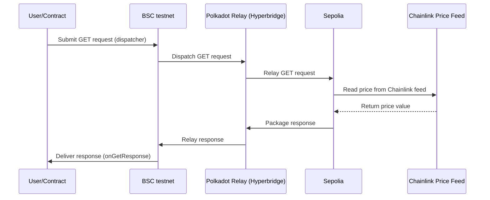

# Hyperbridge Integration Issues & Recommendations

## Overview
This document summarizes the main issues, pain points, and debugging steps encountered while integrating Hyperbridge GET requests for a cross-chain prediction market (BSC testnet → Sepolia). It is intended to help the Hyperbridge team improve developer experience and documentation.

---
### 1. **Missing StateMachine Import**
**Issue**: The contract was trying to import `StateMachine.sol` from the wrong path.
**Fix**: Updated import to use the correct path: `@polytope-labs/ismp-solidity/interfaces/StateMachine.sol`

### 2. **Incorrect DispatchGet Structure**
**Issue**: The `requestPriceGet` function was using the wrong number of fields for `DispatchGet` struct.
**Fix**: Removed the incorrect `sender` field and used the correct 6-field structure:
- `dest`: Destination state machine
- `height`: Block height to read from
- `keys`: Storage keys to read
- `timeout`: Request timeout
- `fee`: Protocol fee
- `context`: Application-specific metadata

## 3. Using the Hyperbridge Faucet for Testnet USD.h

To test Hyperbridge GET requests on BSC testnet, you need USD.h tokens for fees. Hyperbridge provides a faucet contract to obtain testnet USD.h.

**USD.h Token Address (BSC testnet):**
```
0xA801da100bF16D07F668F4A49E1f71fc54D05177
```

**Faucet Contract Address (BSC testnet):**
```
0x1794aB22388303ce9Cb798bE966eeEBeFe59C3a3
```

### How to Use the Faucet (Hardhat Console)

1. Open Hardhat console:
   ```bash
   npx hardhat console --network bscTestnet
   ```
2. Get the faucet contract:
   ```js
   const faucet = await ethers.getContractAt(["function drip(address token) public"], "0x1794aB22388303ce9Cb798bE966eeEBeFe59C3a3")
   ```
3. Call the faucet to receive USD.h:
   ```js
   await faucet.drip("0xA801da100bF16D07F668F4A49E1f71fc54D05177")
   ```
4. Check your balance:
   ```js
   const usd = await ethers.getContractAt("IERC20", "0xA801da100bF16D07F668F4A49E1f71fc54D05177")
   (await usd.balanceOf(YOUR_ADDRESS)).toString()
   ```

- You can call the faucet once per day per address.
- Use the received USD.h to fund your factory or market contracts for Hyperbridge requests.

---

## 4. Destination Encoding Confusion

### **Problem:**
- The documentation and SDK examples are inconsistent about how to encode the `dest` field for GET requests.
- Some sources suggest using a packed state machine + responder address, while the demo and working code use a hex-encoded string like `EVM-11155111`.

### **How to Debug:**
- If your request does not show up on the Hyperbridge explorer, check the destination encoding first.
- Use `ethers.utils.hexlify(ethers.utils.toUtf8Bytes("EVM-11155111"))` for Sepolia, as in the demo.

---

## 5. Relayer/Registration Issues

### **Problem:**
- Even with correct encoding, requests may not be relayed if the responder contract is not registered/whitelisted on the destination chain.
- There is no clear error or feedback if the relayer is not running or not watching the source/destination pair.

### **How to Debug:**
- If you see `PriceRequested` and `FeeTokenSpent` events but never receive a response, check with the Hyperbridge team if your responder is registered and the relayer is running.
- Use the Hyperbridge explorer to see if your request appears at all.

---

## 6. Event Visibility and Debugging

### **Problem:**
- It is difficult to know if a request is being processed, stuck, or failed.
- There is no direct way to trace a request from the source chain to the destination contract.

### **How to Debug:**
- Use event printing scripts to check for `PriceRequested`, `FeeTokenSpent`, and `PriceReceived` events.
- If `PriceReceived` is missing, the request is not being delivered.
- Check the Hyperbridge explorer for your request hash.

### **Recommendation:**
- Add a troubleshooting section to the docs with common event flows and what to expect.
- Provide a CLI or SDK tool to trace a request end-to-end.

---

## 7. Fee Token and Allowance Management

### **Problem:**
- Developers must ensure the contract has enough fee tokens and has approved the dispatcher, but this is not always clear in the docs.
- Errors for insufficient balance or allowance are generic and not Hyperbridge-specific.

### **How to Debug:**
- Check the contract’s fee token balance and allowance for the dispatcher before sending a request.
- If a request reverts, check for ERC20 errors in the transaction logs.

### **Recommendation:**
- Add a section to the docs on fee token management and approval.
- Provide a preflight check utility in the SDK.

---

## Data Flow: Hyperbridge GET Request (BSC testnet → Sepolia → Chainlink Price Feed)

### **High-Level Flow**

1. **BSC testnet (Source Chain):**
   - Your PredictionMarket contract dispatches a GET request via the Hyperbridge dispatcher contract.
   - The request includes the destination ("EVM-11155111" for Sepolia), the storage key (Chainlink feed address + slot), and the fee.

2. **Polkadot Relay (Hyperbridge Network):**
   - The Hyperbridge relayer picks up the request from BSC testnet.
   - The request is relayed through the Polkadot relay chain (Hyperbridge's core network).

3. **Sepolia (Destination Chain):**
   - The request arrives at the Hyperbridge IsmpHost on Sepolia.
   - The IsmpHost reads the requested storage key from the Chainlink Price Feed contract on Sepolia.
   - The value (e.g., latest BTC/USD price) is packaged as a response.

4. **Polkadot Relay (Return Path):**
   - The response is relayed back through the Polkadot relay chain.

5. **BSC testnet (Source Chain):**
   - The response is delivered to your PredictionMarket contract via the dispatcher.
   - Your contract emits `PriceReceived` and resolves the market.

---

### **Mermaid Diagram**



---

### **Step-by-Step Explanation**

1. **User/Contract on BSC testnet**
   - Calls `requestPriceGet` or `autoCloseAndRequest` on the PredictionMarket contract.
   - The contract emits `PriceRequested` and spends the fee token.

2. **BSC Dispatcher**
   - Receives the GET request and emits an event.

3. **Polkadot Relay (Hyperbridge Core)**
   - Relayer picks up the event and relays the request to Sepolia via the Polkadot relay chain.

4. **Sepolia IsmpHost**
   - Receives the request, reads the storage key from the Chainlink Price Feed contract.
   - Packages the price value as a response.

5. **Polkadot Relay (Return)**
   - Relays the response back to BSC testnet.

6. **BSC Dispatcher**
   - Delivers the response to the PredictionMarket contract via `onGetResponse`.
   - The contract emits `PriceReceived` and resolves the market.

---

**This flow ensures trustless, cross-chain data delivery from Chainlink on Sepolia to your contract on BSC testnet, using Hyperbridge as the relay.**

---

**If you need more details or want to discuss any of these points, feel free to reach out!** 